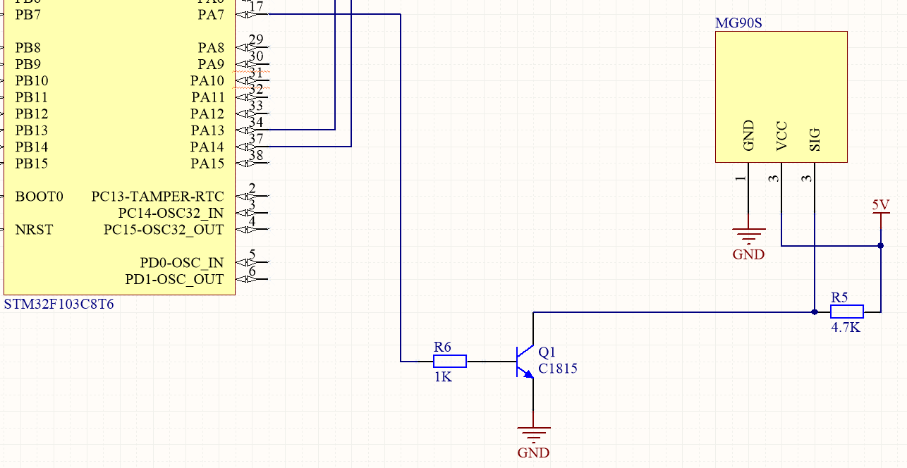
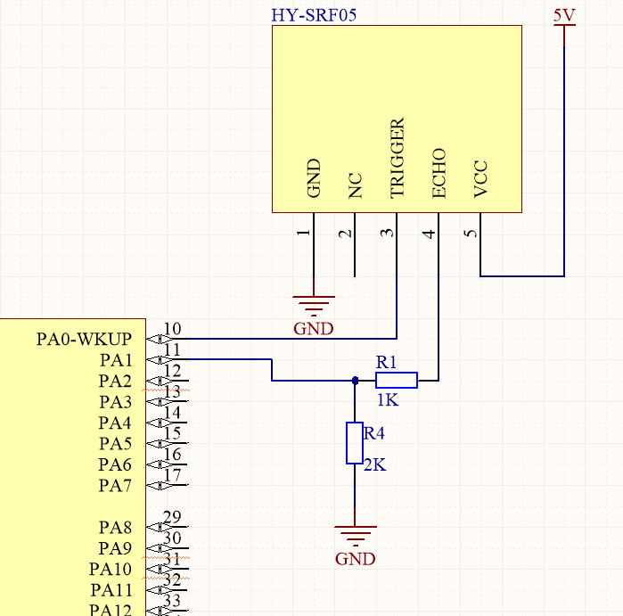

# Управление сервоприводом MG90S 360° на STM32 по данным ультразвукового датчика.

Проект демонстрирует управление скоростью и направлением вращения сервопривода MG90S 360° на основе показаний ультразвукового датчика HY-SRF05, подключённого к STM32F103C8T6 (Blue Pill). Используется ШИМ с уровневым согласованием (3.3в - 5в) через транзистор C1815.

- [Электрическая схема](./docs/ElectricalDiagram.png)
- [Фото в сборе](./docs/photo.jpg)
- [Видеодемонстрация](https://youtube.com/shorts/hdxZxFY5Pmg?feature=share)
- [Подключение ST-LINK V2](./docs/STLinkV2.jpg)
---

## Возможности
- Управление вращением сервопривода MG90S(вперёд/назад)  
- Медианная фильтрация значений для защиты от шумов  
- Генерация ШИМ-сигнала 1300–1700 мкс  
- Фиксация расстояния с помощью датчика HY-SRF05  
- Уровневая буферизация сигнала (3.3В → 5В) с помощью C1815  

---
## Используемые компоненты

| Компонент           | Назначение                             |  
|---------------------|----------------------------------------|  
| STM32F103C8T6       | Микроконтроллер ("Blue Pill")          |  
| HY-SRF05            | Ультразвуковой датчик расстояния       |  
| MG90S 360°          | Сервопривод непрерывного вращения      |  
| C1815 (NPN)         | Транзистор для буферизации PWM         |  
| Резисторы 1к, 4.7кΩ | База и подтяжка коллектора             |  

---
## Подключение

| Назначение         | Пин STM32      | Примечание                    |  
|--------------------|----------------|-------------------------------|  
| TRIG (HY-SRF05)    | PA0            | Выход 3.3В логики напрямую в TRIG (без делителя)   |  
| ECHO (HY-SRF05)    | PA1            | Вход. Используется делитель напряжения: 1кОм + 2кОм|  
| PWM (к базе C1815) | PA7 (TIM3_CH2) | Через 1кОм резистор                                |  

  
 Такая схема усиливает 3.3В ШИМ от STM32 до 5В, необходимого для корректной работы MG90S 360°. MG90S питается от внешнего источника питания: 5В(красный), GND(коричневый).
 Важно:
HY-SRF05 возвращает сигнал 5В на ECHO, а STM32F103C8T6 работает с логикой 3.3В, поэтому необходимо снизить напряжение с помощью делителя:
  
Расчёт:  
Vout = Vin * R2/(R1+R2);  
Vstm = 2/(1+2)*5 = 3.33В;  
Можно использовать любые резисторы с соотношением 1:2, например:  
 - 470 Ом + 1 кОм;  
 - 1 кОм + 2 кОм;  
 - 2.2 кОм + 4.7 кОм;  
(главное — не слишком маленькое сопротивление, чтобы не нагружать выход HY-SRF05)  
Делитель из 1 кОм и 2 кОм понижает уровень до ≈3.3 В, что безопасно для STM32.  

---
## Структура проекта
```
stm32-hcsr04-servo-pwm/
├── Core/                       # Исходники и заголовки проекта
│ ├── Inc/                      # Заголовочные файлы (.h)
│ └── Src/                      # Исходные файлы (.c)
├── Drivers/                    # HAL библиотеки
├── .gitignore                  # Исключения Git
├── Servo SG90 and HY-SRF05.ioc # STM32CubeMX файл конфигурации
└── README.md                   # Документация
```

---
## Конфигурация периферии в STM32CubeMX:

|Периферия |                Настройки                     |  
|----------|----------------------------------------------|  
|TIM3      |CH2 (PA7) — PWM (Prescaler: 71,Period:20000-1)|   
|GPIO      |TRIG (PA0) — Output Push-Pull                 |  
|GPIO      |ECHO (PA1) — Input (no pull / pull-down)      |  

---
## Алгоритм работы  
1. Каждые 100 мс измеряется расстояние (медианный фильтр из 5 значений)    
2. Значение преобразуется в ширину импульса ШИМ:  
 - distance = 0 → pwm = 1400 мкс  
 - distance = 25 → pwm = 1500 мкс (стоп)  
 - distance = 50 → pwm = 1600 мкс  
3. ШИМ поступает на PA7 → C1815 → сигнальный провод MG90S  

---
## Особенности  
 - MG90S 360° не поддерживает точное позиционирование — только направление и скорость.  
 - Используется DWT-таймер для задержек в микросекундах.  
 - Таймауты в GetDistance() защищают от зависаний.  

---
## Сборка и запуск  
1. Открыть .ioc файл в STM32CubeIDE  
2. Собрать проект (`Ctrl + B`)  
3. Прошить через ST-Link  
4. Подключить сервопривод и датчик по схеме выше  
5. Наблюдать поведение сервопривода при приближении